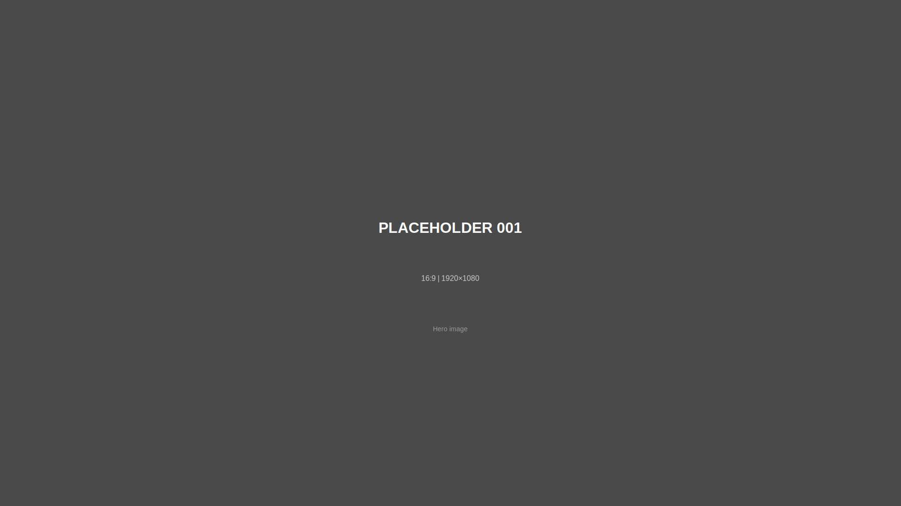
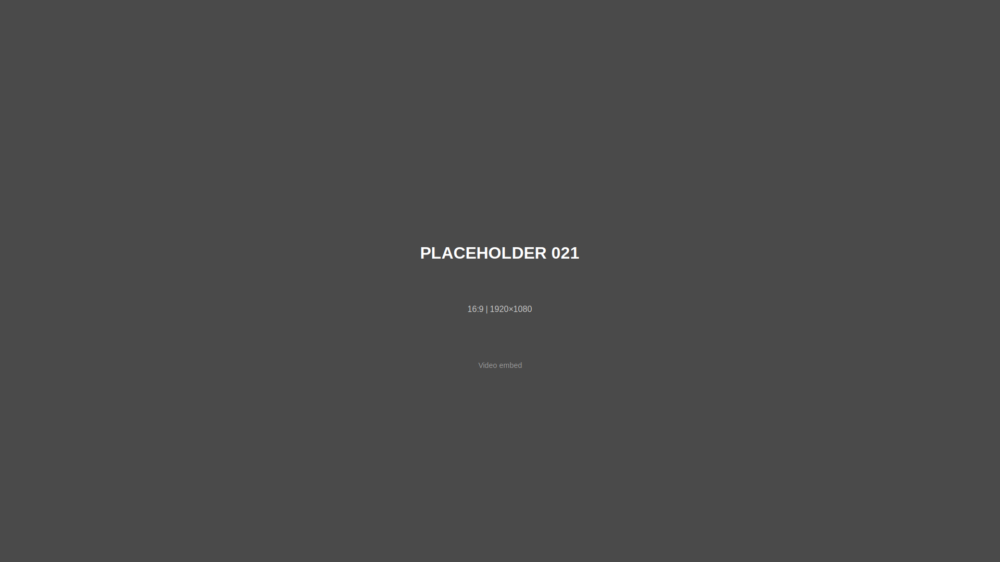

# Placeholder Guide

This document provides a complete reference for all 27 placeholder images used throughout the portfolio website. Each placeholder is numbered and ready to be replaced with actual images.

## How to Replace Placeholders

1. Prepare your image with the recommended dimensions and aspect ratio
2. Save your image to the appropriate directory in `assets/images/`
3. Update the `src` attribute in the HTML file to point to your actual image
4. Keep the `alt` text descriptive for accessibility

**Example:**
```html
<!-- Before -->


<!-- After -->

```

---

## Homepage (index.html)

### Placeholder 001
- **File:** `assets/images/placeholders/001.svg`
- **Location:** Homepage hero section (optional background)
- **Purpose:** Hero/banner image for portfolio introduction
- **Dimensions:** 1920×1080px
- **Aspect Ratio:** 16:9
- **Suggested Content:** Archival materials, workspace, or representative image

### Placeholder 002
- **File:** `assets/images/placeholders/002.svg`
- **Location:** Homepage navigation grid
- **Purpose:** Thumbnail for "Portrait of a Word" page
- **Dimensions:** 800×600px
- **Aspect Ratio:** 4:3
- **Suggested Content:** Representative image from the essay

### Placeholder 003
- **File:** `assets/images/placeholders/003.svg`
- **Location:** Homepage navigation grid
- **Purpose:** Thumbnail for "Feature Article" page
- **Dimensions:** 800×600px
- **Aspect Ratio:** 4:3
- **Suggested Content:** Representative image from the feature article

### Placeholder 004
- **File:** `assets/images/placeholders/004.svg`
- **Location:** Homepage navigation grid
- **Purpose:** Thumbnail for "Documentary" page
- **Dimensions:** 800×600px
- **Aspect Ratio:** 4:3
- **Suggested Content:** Still frame from documentary or related image

### Placeholder 005
- **File:** `assets/images/placeholders/005.svg`
- **Location:** Homepage navigation grid
- **Purpose:** Thumbnail for "Reflection" page
- **Dimensions:** 800×600px
- **Aspect Ratio:** 4:3
- **Suggested Content:** Reflective or contemplative image

### Placeholder 006
- **File:** `assets/images/placeholders/006.svg`
- **Location:** Homepage navigation grid
- **Purpose:** Thumbnail for "Artist Statement" page
- **Dimensions:** 800×600px
- **Aspect Ratio:** 4:3
- **Suggested Content:** Professional or artistic image

---

## Portrait of a Word (portrait-of-word.html)

### Placeholder 007
- **File:** `assets/images/placeholders/007.svg`
- **Location:** Below title, above article body
- **Purpose:** Splash/hero image for essay
- **Dimensions:** 1920×1080px
- **Aspect Ratio:** 16:9
- **Suggested Content:** Key visual representing essay theme

### Placeholder 008
- **File:** `assets/images/placeholders/008.svg`
- **Location:** After paragraph 2 or 3
- **Purpose:** First integrated image in essay
- **Dimensions:** 1200×800px
- **Aspect Ratio:** 3:2
- **Suggested Content:** Supporting visual for essay content

### Placeholder 009
- **File:** `assets/images/placeholders/009.svg`
- **Location:** After paragraph 4
- **Purpose:** Second integrated image in essay
- **Dimensions:** 1200×800px
- **Aspect Ratio:** 3:2
- **Suggested Content:** Supporting visual for essay content

---

## Feature Article (feature-article.html)

### Placeholder 010
- **File:** `assets/images/placeholders/010.svg`
- **Location:** Below title, article splash
- **Purpose:** Main hero image for feature article
- **Dimensions:** 1920×1080px
- **Aspect Ratio:** 16:9
- **Suggested Content:** Striking image representing article theme

### Placeholder 011
- **File:** `assets/images/placeholders/011.svg`
- **Location:** After paragraph 1
- **Purpose:** Feature article image 1
- **Dimensions:** 1200×800px
- **Aspect Ratio:** 3:2
- **Suggested Content:** Article supporting image

### Placeholder 012
- **File:** `assets/images/placeholders/012.svg`
- **Location:** After pull quote 1
- **Purpose:** Feature article image 2
- **Dimensions:** 1200×800px
- **Aspect Ratio:** 3:2
- **Suggested Content:** Article supporting image

### Placeholder 013
- **File:** `assets/images/placeholders/013.svg`
- **Location:** After paragraph 3
- **Purpose:** Feature article image 3
- **Dimensions:** 1200×800px
- **Aspect Ratio:** 3:2
- **Suggested Content:** Article supporting image

### Placeholder 014
- **File:** `assets/images/placeholders/014.svg`
- **Location:** After paragraph 4
- **Purpose:** Feature article image 4
- **Dimensions:** 1200×800px
- **Aspect Ratio:** 3:2
- **Suggested Content:** Article supporting image

### Placeholder 015
- **File:** `assets/images/placeholders/015.svg`
- **Location:** After pull quote 2
- **Purpose:** Feature article image 5
- **Dimensions:** 1200×800px
- **Aspect Ratio:** 3:2
- **Suggested Content:** Article supporting image

### Placeholder 016
- **File:** `assets/images/placeholders/016.svg`
- **Location:** After paragraph 6
- **Purpose:** Feature article image 6
- **Dimensions:** 1200×800px
- **Aspect Ratio:** 3:2
- **Suggested Content:** Article supporting image

### Placeholder 017
- **File:** `assets/images/placeholders/017.svg`
- **Location:** After paragraph 7
- **Purpose:** Feature article image 7
- **Dimensions:** 1200×800px
- **Aspect Ratio:** 3:2
- **Suggested Content:** Article supporting image

### Placeholder 018
- **File:** `assets/images/placeholders/018.svg`
- **Location:** After pull quote 3
- **Purpose:** Feature article image 8
- **Dimensions:** 1200×800px
- **Aspect Ratio:** 3:2
- **Suggested Content:** Article supporting image

### Placeholder 019
- **File:** `assets/images/placeholders/019.svg`
- **Location:** After paragraph 9
- **Purpose:** Feature article image 9
- **Dimensions:** 1200×800px
- **Aspect Ratio:** 3:2
- **Suggested Content:** Article supporting image

### Placeholder 020
- **File:** `assets/images/placeholders/020.svg`
- **Location:** After paragraph 10
- **Purpose:** Feature article image 10
- **Dimensions:** 1200×800px
- **Aspect Ratio:** 3:2
- **Suggested Content:** Article supporting image

---

## Documentary (documentary.html)

### Placeholder 021
- **File:** `assets/images/placeholders/021.svg`
- **Location:** Main video embed area
- **Purpose:** Video embed placeholder (replace with Frame.io iframe)
- **Dimensions:** 1920×1080px
- **Aspect Ratio:** 16:9
- **Note:** This should be replaced with iframe embed code, not an image

**Replacement instructions:**
```html
<!-- Current placeholder -->


<!-- Replace with Frame.io embed code -->
<iframe
    src="YOUR_FRAME_IO_EMBED_URL_HERE"
    frameborder="0"
    allowfullscreen
    allow="autoplay; fullscreen; picture-in-picture">
</iframe>
```

### Placeholder 022
- **File:** `assets/images/placeholders/022.svg`
- **Location:** Optional - not currently used
- **Purpose:** Video thumbnail or poster frame
- **Dimensions:** 1920×1080px
- **Aspect Ratio:** 16:9
- **Suggested Content:** Still frame from video

---

## Reflection (reflection.html)

### Placeholder 023
- **File:** `assets/images/placeholders/023.svg`
- **Location:** Below title, splash image
- **Purpose:** Main hero image for reflection essay
- **Dimensions:** 1920×1080px
- **Aspect Ratio:** 16:9
- **Suggested Content:** Reflective or contemplative image

### Placeholder 024
- **File:** `assets/images/placeholders/024.svg`
- **Location:** Optional - not currently used
- **Purpose:** Additional reflection image (if desired)
- **Dimensions:** 1200×800px
- **Aspect Ratio:** 3:2
- **Suggested Content:** Supporting visual

### Placeholder 025
- **File:** `assets/images/placeholders/025.svg`
- **Location:** Optional - not currently used
- **Purpose:** Additional reflection image (if desired)
- **Dimensions:** 1200×800px
- **Aspect Ratio:** 3:2
- **Suggested Content:** Supporting visual

### Placeholder 026
- **File:** `assets/images/placeholders/026.svg`
- **Location:** Optional - not currently used
- **Purpose:** Additional reflection image (if desired)
- **Dimensions:** 1200×800px
- **Aspect Ratio:** 3:2
- **Suggested Content:** Supporting visual

---

## Artist Statement (artist-statement.html)

### Placeholder 027
- **File:** `assets/images/placeholders/027.svg`
- **Location:** Below title, portrait section
- **Purpose:** Professional portrait photo
- **Dimensions:** 600×800px
- **Aspect Ratio:** 3:4 (portrait orientation)
- **Suggested Content:** Professional headshot or portrait
- **Note:** Image is displayed at max 400px width for elegant presentation

---

## Summary by Type

### Splash/Hero Images (16:9)
- 001, 007, 010, 021, 022, 023

### Page Thumbnails (4:3)
- 002, 003, 004, 005, 006

### Article Images (3:2)
- 008, 009, 011-020, 024, 025, 026

### Portrait Photo (3:4)
- 027

---

## Best Practices

1. **Image Quality:** Use high-resolution images (at least the suggested dimensions)
2. **File Format:**
   - Use JPG for photographs
   - Use PNG for graphics with transparency
   - Use WebP for modern browsers (with JPG fallback)
3. **File Size:** Optimize images to under 500KB when possible
4. **Alt Text:** Always update alt text to describe the actual image content
5. **Captions:** Update image captions to provide context
6. **Consistency:** Maintain consistent color grading and style across images
7. **Responsive:** Images will automatically scale on mobile devices

---

## Directory Structure for Real Images

```
assets/images/
├── placeholders/        # Current placeholder files (027 SVGs)
├── family-photos/       # Replace with actual family photos
├── slides/              # Kodachrome slides and archival materials
├── process-photos/      # Behind-the-scenes or process documentation
└── graphics/            # Diagrams, illustrations, or other graphics
```

---

## Questions?

If you need to adjust image sizes, aspect ratios, or add more placeholders, refer to:
- CSS: `assets/css/style.css` (see image-related styles)
- HTML files: Each page has commented sections indicating placeholder locations

Last updated: 2025-12-10
