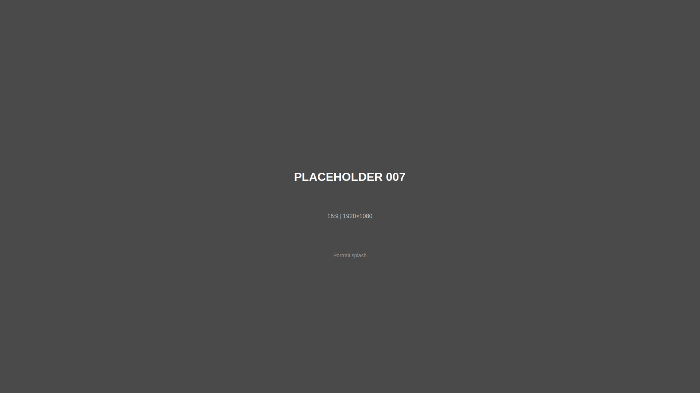

# ENG 1121 Portfolio - Documentary Writing Portfolio

A professional documentary-style portfolio website showcasing writing work about family memory and archival preservation. Built with vanilla HTML, CSS, and minimal JavaScript for maximum performance and simplicity.

## Overview

This is a static website designed for deployment on Netlify, featuring a cinematic documentary aesthetic with clean magazine-style layouts. The site showcases five major writing assignments through an elegant, content-focused interface.

## Tech Stack

- **HTML5** - Semantic markup
- **CSS3** - Custom design system, no frameworks
- **Vanilla JavaScript** - Mobile navigation only
- **Live Server** - Development server (Node.js)
- **Netlify** - Deployment target

## Quick Start

```bash
# Install dependencies (live-server)
npm install

# Start development server at http://localhost:8080
npm start
```

## Site Structure

### Pages (6 total)

```
├── index.html                 # Homepage with visual navigation grid
├── portrait-of-word.html      # "How to Talk to a Wizard" essay
├── feature-article.html       # "Memory Machines and the Human Witness" article
├── documentary.html           # Video documentary page
├── reflection.html            # Portfolio reflection essay
└── artist-statement.html      # Artist statement with portrait
```

### Assets

```
assets/
├── css/
│   └── style.css              # Single comprehensive stylesheet
├── images/
│   ├── placeholders/          # 27 numbered SVG placeholders (001-027)
│   ├── family-photos/         # Real family photos (user adds)
│   ├── slides/                # Kodachrome slides (user adds)
│   ├── process-photos/        # Process documentation (user adds)
│   └── graphics/              # Diagrams and illustrations (user adds)
├── docs/
│   ├── project-briefing.txt   # Complete project specifications
│   └── style-guide.txt        # Design system reference
├── videos/
│   └── video-links.txt        # Video embed URLs
└── text/                      # Essay content (user adds)
```

## Design System

### Color Palette

```css
/* Primary */
--film-black: #050505;          /* Background */
--zinc-100: #fafafa;            /* Primary text */
--zinc-400: #a1a1aa;            /* Secondary text */
--zinc-500: #71717a;            /* Technical metadata */

/* Accents */
--kodak-red: #E31F26;           /* Primary accent - brand color */
--kodak-yellow: #FFC629;        /* Secondary accent */
--emerald-500: #10b981;         /* Captions (bright) */
--emerald-700: #047857;         /* Captions (dark) */
```

### Typography

```css
/* Headings & Quotes */
font-family: 'Playfair Display', serif;

/* Body Text */
font-family: 'Inter', sans-serif;

/* Technical & Metadata */
font-family: 'JetBrains Mono', monospace;
```

**Type Scale:**
- `h1`: 3.5rem (56px)
- `h2`: 2.5rem (40px)
- `h3`: 1.75rem (28px)
- Body: 1.125rem (18px)
- Captions: 0.9rem (14.4px)

### Key Design Patterns

#### 1. Subtitles (Technical Headers)
```css
.subtitle {
    font-family: 'JetBrains Mono', monospace;
    text-transform: uppercase;
    letter-spacing: 0.4em;      /* Very wide tracking */
    color: #E31F26;             /* Kodak Red */
}
```

#### 2. Pull Quotes
```css
.pull-quote {
    font-family: 'Playfair Display', serif;
    font-size: 1.75rem;
    font-style: italic;
}

.pull-quote-side {
    border-left: 3px solid #E31F26;
    padding-left: 2rem;
}
```

#### 3. Image Captions (Two Styles)

**Glassmorphism Card** (Hero images):
```css
.image-caption-card {
    background: rgba(0, 0, 0, 0.4);
    backdrop-filter: blur(12px);
}
/* Caption: Emerald-500, Date: Emerald-700 */
```

**Gradient Overlay** (Grid images):
```css
.image-caption-overlay {
    background: linear-gradient(to top, rgba(0, 0, 0, 0.8), transparent);
    font-family: 'Playfair Display', serif;
    font-style: italic;
}
```

#### 4. Technical Metadata
```css
.tech-meta {
    font-family: 'JetBrains Mono', monospace;
    text-transform: uppercase;
    letter-spacing: 0.15em;
    color: #71717a;             /* Zinc-500 */
}
```

#### 5. Video Embed (Cinematic Style)
```css
.video-wrapper {
    padding-bottom: 56.25%;     /* 16:9 aspect ratio lock */
    box-shadow: 0 20px 80px rgba(0, 0, 0, 0.6); /* Floating projection screen */
    border-radius: 0;            /* Sharp edges for cinema feel */
}
```

## Responsive Breakpoints

```css
/* Desktop (default) */
1440px+

/* Laptop */
@media (max-width: 1439px) { }

/* Tablet */
@media (max-width: 1023px) {
    /* 2-column grid */
}

/* Mobile */
@media (max-width: 767px) {
    /* Hamburger menu, single column */
}

/* Small Mobile */
@media (max-width: 374px) { }
```

## Navigation System

### Desktop
- Sticky header with glassmorphism effect
- Horizontal nav links
- Active page highlighted with Kodak Red underline

### Mobile (≤767px)
- Hamburger menu (top right)
- Slide-in menu from right
- Glassmorphism backdrop
- Auto-closes on link click or outside click

### Homepage Special
- Visual navigation grid (5 cards)
- Each card links to a main page
- Hover effect: lift + red shadow

## Placeholder System

All media uses numbered placeholders (001-027) for easy content replacement.

### Placeholder Reference

See `PLACEHOLDER_GUIDE.md` for complete details.

**Quick Reference:**
- **001-006**: Homepage thumbnails
- **007-009**: Portrait of Word page
- **010-020**: Feature Article images (11 total)
- **021-022**: Video embed
- **023-026**: Reflection page
- **027**: Portrait photo

### Replacing Placeholders

**Images:**
```html
<!-- Before -->


<!-- After -->

```

**Video:**
```html
<!-- Get full embed code from Frame.io Share > Embed -->
<iframe src="FRAME_IO_EMBED_URL" ...></iframe>
```

**Text:**
- Open HTML file
- Replace lorem ipsum with actual content
- Update pull quotes with real quotes
- Add actual citations

## CSS Organization

The single stylesheet (`assets/css/style.css`) is organized into sections:

```
1.  CSS Reset & Base Styles
2.  Typography
3.  Layout Containers
4.  Navigation
5.  Hero Sections
6.  Visual Navigation Grid
7.  Article Layouts
8.  Pull Quotes
9.  Block Quotes
10. Images & Captions
11. Technical Metadata Styling
12. Video Embed
13. Reflection Sections
14. Citations
15. Footer
16. Animations
17. Utility Classes
18. Responsive Design
19. Print Styles
```

## Key Features

### 1. Glassmorphism
- Semi-transparent backgrounds
- Backdrop blur effects
- Used on navigation cards and caption cards

### 2. Floating Elements
- Deep, diffuse shadows: `0 20px 80px rgba(0, 0, 0, 0.6)`
- Creates "projection screen in dark room" effect
- No borders on video embeds

### 3. Smooth Animations
```css
scroll-behavior: smooth;        /* Smooth anchor scrolling */

@keyframes fadeInUp {           /* Page entrance animation */
    from { opacity: 0; transform: translateY(30px); }
    to { opacity: 1; transform: translateY(0); }
}

.pulse-dot {                    /* Live indicator */
    animation: pulse 2s infinite;
}
```

### 4. Accessible
- Semantic HTML5 elements
- ARIA labels on interactive elements
- Keyboard navigation support
- Alt text on all images
- High contrast (WCAG AA compliant)

## Customization

### Change Colors

Edit CSS variables (add these to `:root` if converting to CSS vars):

```css
/* Find and replace in style.css: */
#050505  →  Your background color
#E31F26  →  Your primary accent
#fafafa  →  Your text color
```

### Change Fonts

1. Update Google Fonts import in `style.css:29`
2. Update font-family declarations throughout

### Add More Pages

1. Copy an existing HTML file as template
2. Update `<title>`, content, and active nav state
3. Add link to navigation in all pages
4. Update homepage grid if needed

### Adjust Layout

All layout containers use max-width:
- `.container`: 1200px
- `.container-narrow`: 800px
- `.container-wide`: 1400px
- `.article-body`: 720px (optimal reading width)

## Performance Optimization

- **No frameworks** - Pure vanilla code for minimal payload
- **Single CSS file** - One HTTP request for styles
- **Minimal JavaScript** - Only for mobile menu (can be removed)
- **SVG placeholders** - Tiny file sizes during development
- **System fonts fallback** - Works without Google Fonts

## Deployment

### Netlify (Recommended)

1. Push code to Git repository
2. Connect repository to Netlify
3. Build settings: None needed (static site)
4. Deploy

**Or drag-and-drop:**
1. Build locally (not required - already static)
2. Drag entire project folder to Netlify

### Other Hosts

This is a static site - works on any web server:
- GitHub Pages
- Vercel
- Surge
- Traditional hosting (FTP)

## Browser Support

- Chrome/Edge (latest)
- Firefox (latest)
- Safari (latest)
- Mobile browsers (iOS Safari, Chrome Android)

**Note:** Uses modern CSS (backdrop-filter, aspect-ratio via padding-bottom). For older browsers, graceful degradation occurs.

## Development Notes

### No Build Process
This project intentionally has **no build step**. It's pure HTML/CSS/JS for:
- Easy editing
- Fast iteration
- Simple deployment
- Long-term maintainability

### File Naming
- HTML: lowercase-with-hyphens.html
- Images: descriptive-name.jpg
- Classes: kebab-case

### Code Style
- **Indentation**: 4 spaces
- **Comments**: Section headers in CSS, explanatory in HTML
- **Semantic HTML**: Proper use of `<article>`, `<section>`, `<header>`, etc.

## Troubleshooting

**Mobile menu not working:**
- Check JavaScript at bottom of each HTML file
- Ensure `.hamburger` and `.nav-links` classes are correct

**Video not showing:**
- Use full iframe embed code from Frame.io
- Check that URL parameters are not breaking the link
- Ensure `.video-wrapper` has padding-bottom: 56.25%

**Fonts not loading:**
- Check Google Fonts import in CSS
- Verify network connection
- Fallback fonts will load if Google Fonts fails

**Images not showing:**
- Check file path (case-sensitive on Linux/Mac servers)
- Verify image exists in correct directory
- Check browser console for 404 errors

## Future Enhancements

Potential additions (keeping static site philosophy):
- Print stylesheet refinement
- Dark/light mode toggle (CSS only)
- Lazy loading for images
- Progressive Web App (PWA) manifest
- RSS feed for writing samples

## License

Academic project - ENG 1121, City Tech, 2025

## Contact

**Developer:** Zachary Holbert
**Course:** ENG 1121 (English Composition II)
**Institution:** New York City College of Technology

---

**Last Updated:** December 2025
**Version:** 1.0.0
